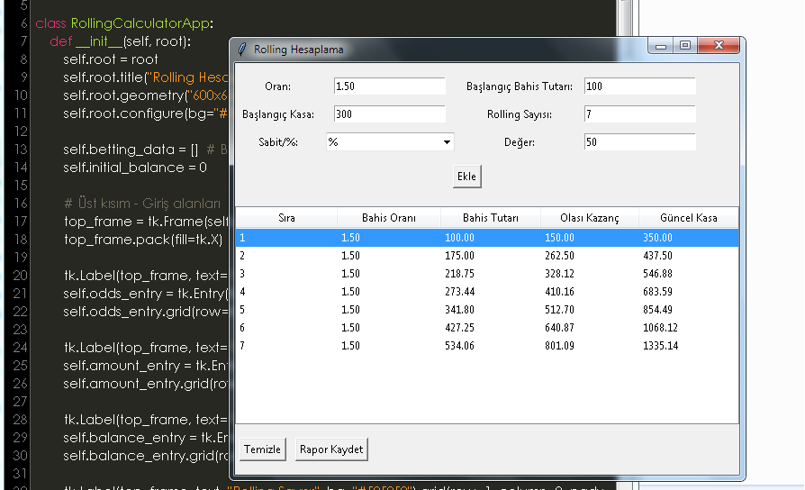

# Rolling Calculator

## Genel Bakış

Rolling Calculator, spor bahislerinde kullanılmak üzere geliştirilmiş bir uygulamadır. Bu uygulama, bahis oranları, bahis tutarları, başlangıç kasası ve rolling sayısı gibi verileri girerek bahislerinizi yönetmenizi sağlar. Kazanç ve kayıpları takip eder, güncel kasa durumunu ve bahis tutarlarını hesaplar. Program ayrıca, veri girişini ve hesaplamaları kaydedip yüklemeyi destekler.

## Özellikler

- **Bahis Oranı**: Bahis oranını girin (örneğin, 2.0).
- **Başlangıç Bahis Tutarı**: İlk bahis tutarını belirtin.
- **Başlangıç Kasa**: İlk kasa miktarını girin.
- **Rolling Sayısı**: Toplam rolling sayısını belirtin.
- **Sabit/% Seçeneği**: Bahis tutarının hesaplanma yöntemini seçin:
  - **Sabit**: Güncel kasa miktarını belirli bir değere bölerek hesaplar.
  - **%**: Güncel kasa miktarının belirli bir yüzdesini kullanır.
- **Değer**: Sabit veya yüzdelik hesaplamada kullanılacak değer.

## Nasıl Çalışır?

1. **Giriş Yapın**: Bahis oranı, başlangıç bahis tutarı, başlangıç kasa miktarı, rolling sayısı ve seçenekler gibi bilgileri girin.
2. **Ekle**: "Ekle" butonuna basarak bahisleri tabloya ekleyin. Güncel kasa durumu, bahis tutarı ve olası kazanç hesaplanır.
3. **Raporu Kaydet**: Verileri ve hesaplamaları `conf_log.ini` dosyasına kaydedin.
4. **Raporu Yükle**: Daha önce kaydedilmiş raporu yükleyin ve verileri uygulamaya geri getirin.
5. **Temizle**: Tabloyu ve girilen değerleri temizleyin.

## Dosya Formatı

- **conf_log.ini**: Program tarafından kaydedilen ve yüklenen verileri içeren dosya. Bu dosya, bahis oranı, başlangıç tutarları, seçenekler ve tablodaki bahis sonuçlarını içerir.

## Kullanım

1. Programı açın ve gerekli alanları doldurun.
2. "Ekle" butonuna tıklayarak bahisleri ekleyin.
3. Hesaplamaları gözden geçirin ve gerekli düzenlemeleri yapın.
4. "Rapor Kaydet" butonuna tıklayarak verileri kaydedin veya "Temizle" butonuna tıklayarak tabloyu temizleyin.
5. Daha sonra tekrar çalıştırarak kaydedilmiş verileri yükleyin ve devam edin.

# Bu Yazılımın Standart Rolling Sisteminden Farkı Nedir ?
Rolling bahis stratejisi, uzun vadede büyük kazançlar sağlayabilir. Hazırladığımız yeni özellikte ise kullanıcı kazancının belirlediği oranda sabit veya % oranında kasada kalmasını sağlayabilir ve daha istikrarlı uzun vade kazançları elde edebilir kasayı riske atmadan kayıp durumunda bir önceki kalan kasanın miktarından devam edebilir. Burda önemli olan başlangıç kasanız ile başlangıç tutarınızın doğru girilmesidir. Başlangıç Bahis tutarı başkangıç kasasından herzaman küçük olmak zorundadır.

# Standart Rolling Bahis Nedir?

Rolling bahis, spor bahislerinde kullanılan bir stratejidir. Bu sistemde, bir bahis kazandığında, kazanç ve ana para bir sonraki bahiste yeniden yatırılır. Başarılı bahis serileri, katlanarak artan kazançlar sağlar. Ancak, bir kayıp durumunda, yatırılan ana para ve kazançlar tamamen kaybedilir.

## Standart Rolling Bahis Nasıl Oynanır?

1. **Başlangıç Kasa Tutarı Seçilir:**
   Oyuncu, bahis yapmaya başlamadan önce bir başlangıç kasası belirler. Bu kasa, bahis serisinde kullanılacak olan ana paradır.

2. **Bahis Oranı ve Tutarı Belirlenir:**
   İlk bahis yapılırken bir bahis oranı ve buna göre bir tutar belirlenir. Bu oran, kazanma durumunda elde edilecek kazançları belirler.

3. **İlk Bahis Yapılır:**
   Belirlenen bahis oranı ve tutarıyla ilk bahis oynanır. Eğer bu bahis kazanılırsa, kazanç ve ana para bir sonraki bahise yatırılır.

4. **Kazanç ve Kasa Artışı:**
   Her kazançtan sonra, kazançlar ve ana para toplanır ve bir sonraki bahis için kullanılır. Bu işlem, bir kayıp yaşanana kadar devam eder.

5. **Kayıp Durumu:**
   Eğer bir bahis kaybedilirse, tüm kazançlar ve ana para kaybedilir. Kasa sıfırlanır ve yeniden başlamak için yeni bir kasa belirlenir.

6. **Strateji ve Kontrol:**
   Rolling bahis stratejisi, dikkatli kontrol gerektirir. Kasa yönetimi ve kayıpların minimize edilmesi için oyuncuların riski doğru şekilde yönetmesi önemlidir. Kazançlar büyüdükçe, bahislere yatırılan miktarlar da artar ve risk seviyesi yükselir.

